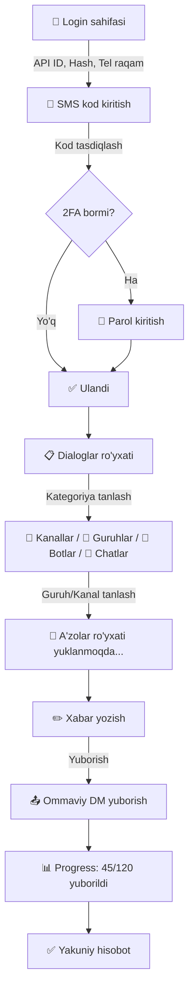

# XABARbot — Telegram Xabar Yuborish Web Ilovasi

Foydalanuvchi o'z Telegram akkauntiga API ID, API Hash va telefon raqami orqali ulanadi. Ulangandan so'ng barcha dialog (kanal, guruh, bot, shaxsiy chat) ro'yxati ko'rsatiladi. Foydalanuvchi kerakli guruh/kanalni tanlaydi va uning a'zolariga ommaviy xabar (DM) yuboradi.

## Texnologiyalar

| Qatlam | Texnologiya | Sabab |
|:---|:---|:---|
| **Frontend Framework** | **Vite + Vanilla JS** | Tez, yengil, bundler tayyor |
| **Telegram Client** | **GramJS (`telegram` npm)** | Brauzerda MTProto ishlaydi, `getDialogs`, `getParticipants`, `sendMessage` tayyor |
| **Sessiya saqlash** | `localStorage` (`StringSession`) | Sahifa yangilanganda qayta login talab qilinmaydi |
| **Stilizatsiya** | Vanilla CSS (glassmorphism + dark mode) | Premium ko'rinish |

---

## User Review Required

> [!WARNING]
> **Telegram cheklovlari:**
> - Telegram ommaviy xabar yuborishni cheklaydi (~30 xabar/soniya). Dastur har xabar orasida 1-2 soniya kutish (`delay`) qo'yadi, lekin juda ko'p a'zoga yuborilsa akkaunt vaqtincha bloklanishi mumkin.
> - Faqat **supergroup** va **channel** dan a'zolar ro'yxatini olish mumkin. Oddiy (legacy) guruhlarda `getParticipants` ishlamasligi mumkin.
> - Shaxsiy kanallar/guruhlarning a'zolarini olish uchun admin huquqi kerak bo'lishi mumkin.

> [!IMPORTANT]
> **Xavfsizlik:**
> - API ID va API Hash foydalanuvchi brauzerida saqlanadi (localStorage). Bu loyiha shaxsiy foydalanish uchun mo'ljallangan. Agar ommaviy deploy qilinsa, backend qatlam (Node.js server) kerak.

---

## Open Questions

> [!IMPORTANT]
> 1. **Xabar yuborish tezligi:** Har xabar orasida qancha kutish kerak? Default 1.5 soniya qo'yaman. Boshqa qiymat kerakmi?
> 2. **Fayl/rasm yuborish:** Faqat matn xabar yuborilsinmi yoki rasm/fayl ham kerakmi? Hozircha faqat matn rejalashtiraman.
> 3. **Til:** Interfeys o'zbek tilida bo'lsinmi yoki inglizcha?

---

## Proposed Changes

Loyiha tuzilishi:

```
d:\XABARbot\
├── index.html              # Asosiy HTML
├── package.json            # npm konfiguratsiya
├── vite.config.js          # Vite sozlamalari
├── src/
│   ├── main.js             # Entry point
│   ├── style.css           # Global stillar
│   ├── auth.js             # Telegram autentifikatsiya moduli
│   ├── dialogs.js          # Dialoglar (kanal/guruh/bot/chat) ro'yxati
│   ├── participants.js     # A'zolar ro'yxatini olish
│   ├── sender.js           # Xabar yuborish (ommaviy DM)
│   └── ui.js               # UI render va navigation
```

---

### Auth Component (Telegram ulanish)

#### [NEW] [auth.js](file:///d:/XABARbot/src/auth.js)
- `TelegramClient` yaratish (`apiId`, `apiHash`, `StringSession`)
- `client.start()` chaqirish: telefon raqami, SMS kod, 2FA parol so'rash
- Muvaffaqiyatli ulanishdan so'ng `StringSession`ni `localStorage`ga saqlash
- Qayta kirganida sessiyani tiklash (login talab qilinmaydi)

**UI qismi:**
- 3 ta input: API ID, API Hash, Telefon raqam
- "Ulanish" tugmasi → SMS kod so'rash modal → 2FA parol (agar kerak bo'lsa)
- Ulanish holati indikatori (spinner, xatolik xabari)

---

### Dialogs Component (Chatlar ro'yxati)

#### [NEW] [dialogs.js](file:///d:/XABARbot/src/dialogs.js)
- `client.getDialogs()` orqali barcha dialoglarni olish
- Dialoglarni kategoriyalarga ajratish:
  - 📢 **Kanallar** (`entity instanceof Api.Channel && entity.broadcast`)
  - 👥 **Guruhlar** (`entity instanceof Api.Channel && entity.megagroup` yoki `Api.Chat`)
  - 🤖 **Botlar** (`entity instanceof Api.User && entity.bot`)
  - 💬 **Shaxsiy chatlar** (`entity instanceof Api.User && !entity.bot`)
- Har bir kategoriya uchun alohida bo'lim (collapsible section)
- Har bir dialog uchun: nomi, a'zolar soni, rasm (avatar)

**UI qismi:**
- 4 ta tab yoki collapsible bo'lim
- Har bir chatni bosish → tanlash (radio/checkbox)
- Qidiruv filtri (chat nomini qidirish)

---

### Participants Component (A'zolar ro'yxati)

#### [NEW] [participants.js](file:///d:/XABARbot/src/participants.js)
- Tanlangan guruh/kanaldan `client.getParticipants()` orqali a'zolarni olish
- A'zolarni sahifalab (pagination) yuklash (aggressive → limit 200, offset qo'yib)
- Bot va o'chirilgan akkauntlarni filtrlash
- A'zolar sonini ko'rsatish

**UI qismi:**
- A'zolar ro'yxati (ism, username, status)
- Umumiy son ko'rsatish
- Yuklash jarayoni (progress bar)

---

### Sender Component (Xabar yuborish)

#### [NEW] [sender.js](file:///d:/XABARbot/src/sender.js)
- Textarea orqali xabar matnini olish
- `client.sendMessage(userId, { message })` orqali har bir a'zoga alohida DM yuborish
- Rate limiting: har xabar orasida 1.5 soniya `delay`
- Xatoliklarni handle qilish:
  - `FloodWaitError` → ko'rsatilgan vaqt kutish
  - `UserPrivacyRestrictedError` → o'tkazib yuborish
  - `PeerFloodError` → to'xtatish va ogohlantirish
- Real-time progress: yuborilgan/jami/xatolik soni

**UI qismi:**
- Xabar yozish textarea (markdown qo'llab-quvvatlanadi)
- "Yuborish" tugmasi + "To'xtatish" tugmasi
- Progress bar + log (kimga yuborildi, kimda xatolik)
- Yakuniy hisobot: muvaffaqiyatli / xatolik / o'tkazilgan

---

### UI va Stillar

#### [NEW] [style.css](file:///d:/XABARbot/src/style.css)
- **Dark mode** asosiy tema (Telegram ranglariga mos)
- **Glassmorphism** effektlar (login kartasi, dialog kartalar)
- **Gradient** tugmalar va aksent ranglar
- **Micro-animatsiyalar**: hover, loading, progress
- **Google Font**: Inter yoki Outfit
- Responsive dizayn (mobil mos)
- Rang palitrasi:
  - Background: `#0f0f23` → `#1a1a3e`
  - Aksent: `#7c3aed` (purple) → `#06b6d4` (cyan)
  - Card: `rgba(255,255,255,0.05)` glassmorphism
  - Matn: `#e2e8f0`

#### [NEW] [ui.js](file:///d:/XABARbot/src/ui.js)
- SPA navigatsiya (3 sahifa/step):
  1. **Login sahifasi** — API credentials va telefon raqam
  2. **Dialoglar sahifasi** — kategoriyalangan chatlar, tanlash
  3. **Xabar yuborish sahifasi** — a'zolar ro'yxati, xabar textarea, progress
- Step indikatori (1 → 2 → 3)
- Toast xabarnomalar (muvaffaqiyat, xatolik)

---

### Loyiha konfiguratsiya

#### [NEW] [package.json](file:///d:/XABARbot/package.json)
```json
{
  "name": "xabarbot",
  "private": true,
  "type": "module",
  "scripts": {
    "dev": "vite",
    "build": "vite build"
  },
  "dependencies": {
    "telegram": "^2.x",
    "input": "^1.x"
  },
  "devDependencies": {
    "vite": "^6.x"
  }
}
```

#### [NEW] [vite.config.js](file:///d:/XABARbot/vite.config.js)
- Node.js polyfill-lar (GramJS brauzerda ishlashi uchun `buffer`, `crypto` polyfill)

#### [NEW] [index.html](file:///d:/XABARbot/index.html)
- Asosiy HTML sahifa
- Google Font import (Inter)
- `#app` container

---

## Ishlash jarayoni (User Flow)



---

## Verification Plan

### Manual Verification
1. `npm run dev` orqali loyihani ishga tushirish
2. API ID, API Hash va telefon raqam bilan ulanish
3. Dialoglar ro'yxati to'g'ri kategoriyalashtirilganini tekshirish
4. Kichik test guruhidan a'zolarni olish
5. 2-3 ta a'zoga test xabar yuborish
6. Progress bar va xatolik loglarini tekshirish
7. Sahifa yangilanishidan so'ng sessiya tiklanishini tekshirish

### Automated Tests
- Loyiha build bo'lishini tekshirish: `npm run build`
